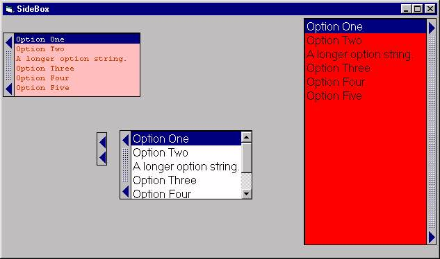



## Side Box

### Description

This user control extends a portion of the standard ListBox ActiveX control, adding a graphical button that "opens" and "closes" to left or right.
 
### More Info
 

             |
---                |---
**Submitted On**   |2005-06-20 11:35:42
**By**             |[David M Rice](https://github.com/Planet-Source-Code/PSCIndex/blob/master/ByAuthor/david-m-rice.md)
**Level**          |Beginner
**User Rating**    |4.9 (44 globes from 9 users)
**Compatibility**  |VB 5\.0, VB 6\.0
**Category**       |[Custom Controls/ Forms/  Menus](https://github.com/Planet-Source-Code/PSCIndex/blob/master/ByCategory/custom-controls-forms-menus__1-4.md)
**World**          |[Visual Basic](https://github.com/Planet-Source-Code/PSCIndex/blob/master/ByWorld/visual-basic.md)
**Archive File**   |[Side\_Box1903966202005\.ZIP](https://github.com/Planet-Source-Code/david-m-rice-side-box__1-61265/archive/master.zip)

